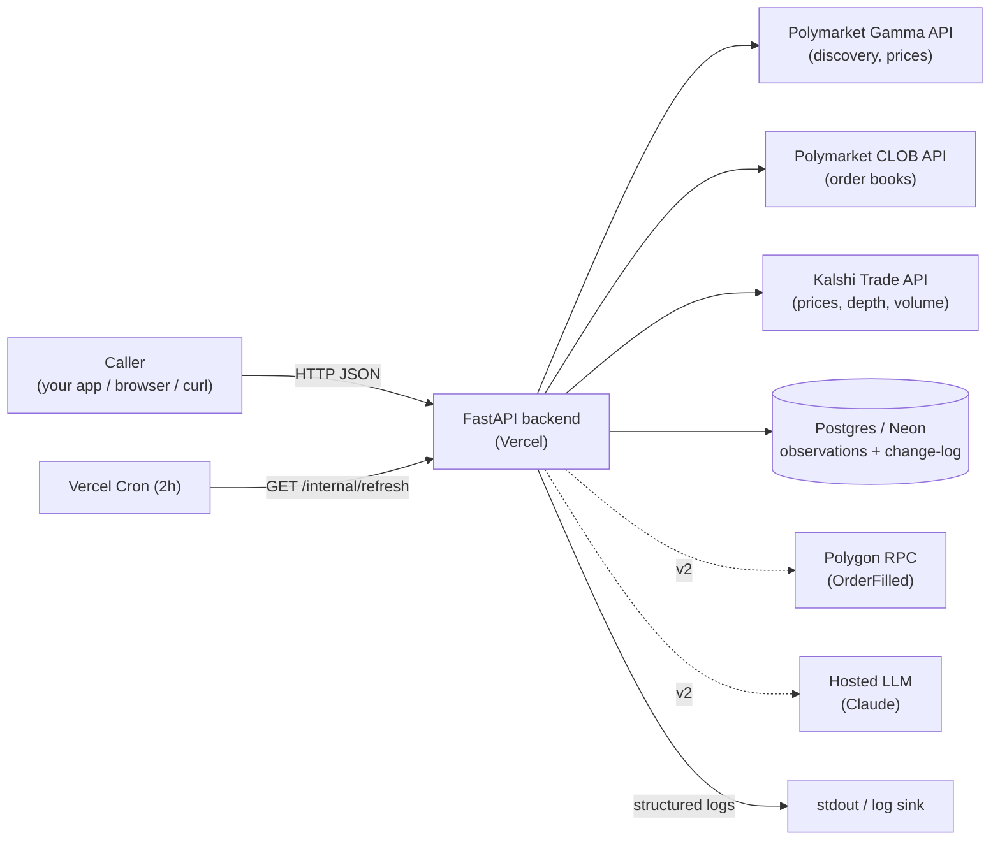
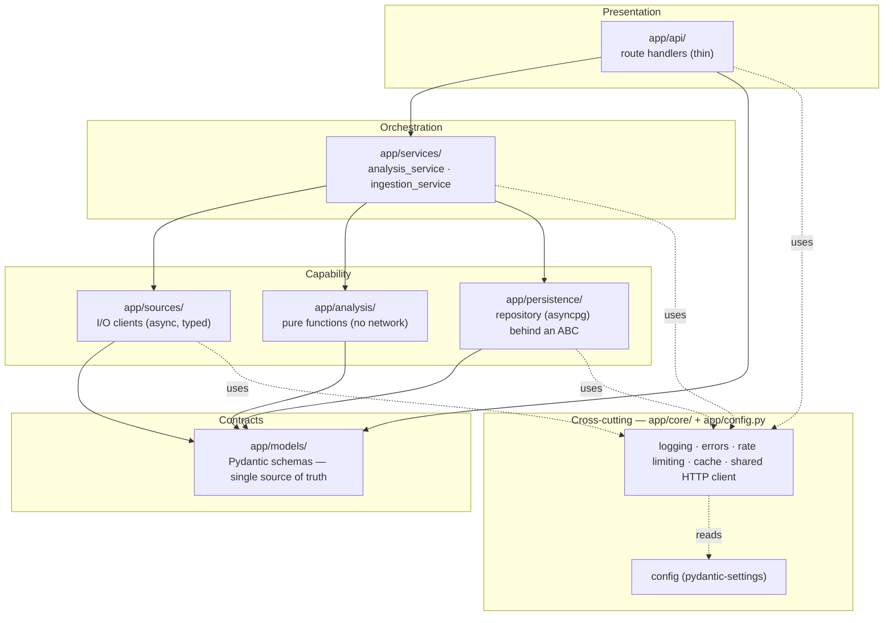
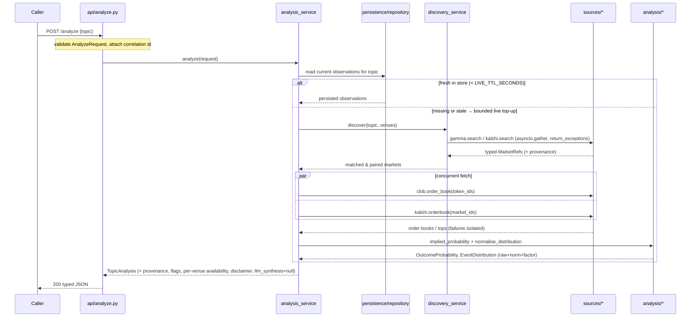

# ARCHITECTURE.md

The complete repository architecture for the prediction-market analysis backend. This document defines **what each part does, where it lives, and how the parts depend on each other**. It is the authority on structure; `CLAUDE.md` is the authority on standards, and `PLANNING.md` on build sequencing.

Design goals, in priority order: **auditable** (every probability traceable to a source), **modular** (SRP + SLAP, no spaghetti), **observable** (every boundary logged), **resilient** (graceful degradation over failure), **extensible** (add a venue, swap the store, add the v2 LLM/on-chain layers without rewrites).

> **v1 scope.** This document describes the full intended system. The `app/llm/` layer and `app/sources/polymarket_chain.py` (+ the wallet/smart-money analysis) are **v2 seams**: their shape is defined here so they slot in cleanly, but they are **not implemented in v1**. v1 = Polymarket + Kalshi prices → probabilities → Postgres → API, on Vercel. Such v2-only parts are marked **(v2)**.

---

## 1. System context



The backend is the only thing the caller talks to. It never exposes venue credentials or DB details outward; it returns typed JSON with provenance. The serving API and the cron ingester are the **same `app/` package**, differing only in entry point.

---

## 2. Design principles and how they are enforced

| Principle | Enforcement in this repo |
|---|---|
| **SRP** — one reason to change per unit | One client per source in `sources/`; one pure function per computation in `analysis/`; the repository only does SQL; services only orchestrate; handlers only translate HTTP ↔ models. |
| **SLAP** — one level of abstraction per function | Orchestration functions read as named steps; raw httpx/SQL detail lives in lower helpers. |
| **Dependency rule** — dependencies point inward | `api → services → {sources, analysis, persistence}`; `analysis → models` only; `models → nothing`. Enforced by review and import discipline. No cycles. |
| **I/O ≠ logic** | All network in `sources/`, all SQL in `persistence/`, all math in `analysis/` (pure, no imports of `httpx`/`asyncpg`). |
| **Composition + DI** | Swap points are protocols/ABCs (`MarketRepository`; **(v2)** `LLMProvider`); concrete implementations injected via config/lifespan. |
| **Fail loudly at edges, degrade gracefully in the middle** | Pydantic validation at boundaries raises on drift; the service layer catches narrow exceptions and returns partial results with flags. |

---

## 3. Layered architecture



**Dependency rule, stated plainly:** an arrow may only point down or sideways into `models`/`core`. `analysis/` imports nothing but `models` and the stdlib — never `httpx`, `asyncpg`, or `sources`. If you find yourself wanting an inner layer to import an outer one, the design is wrong.

---

## 4. Directory structure

```
prediction-market-api/
├── app/
│   ├── main.py                  # FastAPI app: lifespan (DB pool), middleware, router wiring
│   ├── ingest.py                # CLI entry point for one ingestion run (python -m app.ingest)
│   ├── config.py                # pydantic-settings: all env-driven configuration
│   │
│   ├── core/                    # cross-cutting concerns (no business logic)
│   │   ├── logging.py           # structured JSON logging + correlation-id contextvar
│   │   ├── middleware.py        # request-id middleware, access logging, timing
│   │   ├── errors.py            # exception hierarchy + FastAPI exception handlers
│   │   ├── http.py              # shared async httpx client factory (timeouts, headers)
│   │   └── rate_limit.py        # per-source async limiter + exponential backoff/jitter
│   │
│   ├── models/                  # ALL Pydantic v2 schemas — one source of truth
│   │   ├── requests.py          # AnalyzeRequest, SearchRequest
│   │   ├── domain.py            # MarketRef, OrderBookTop, OutcomeProbability, EventDistribution,
│   │   │                        #   MarketObservation, ProbabilityChange
│   │   ├── responses.py         # TopicAnalysis, MarketDetail, HistoryPoint, HealthStatus
│   │   └── provenance.py        # Provenance, ConfidenceFlag, Disclaimer
│   │
│   ├── sources/                 # one client per source — typed in, typed out, async
│   │   ├── polymarket_gamma.py  # topic → events/markets (/search, /events, /markets, /tags)
│   │   ├── polymarket_clob.py   # token_id → order book → best bid/ask/mid/spread
│   │   ├── kalshi.py            # topic → markets, price, depth, volume (no wallets)
│   │   └── polymarket_chain.py  # (v2) OrderFilled reader (Polygon RPC, read-only)
│   │
│   ├── analysis/                # PURE functions — no network, most heavily tested
│   │   ├── probability.py       # implied_probability(order_book) -> OutcomeProbability
│   │   ├── distribution.py      # normalise_distribution(markets) -> EventDistribution
│   │   ├── changes.py           # probability delta + materiality
│   │   ├── wallets.py           # (v2) score_wallets(fills, resolved_history)
│   │   └── smart_money.py       # (v2) smart_money_tilt(recent_fills, scores)
│   │
│   ├── persistence/             # the ONLY module that touches Postgres
│   │   ├── schema.sql           # DDL (applied by an explicit migrate step)
│   │   ├── migrate.py           # apply schema.sql (python -m app.persistence.migrate)
│   │   └── repository.py        # MarketRepository ABC + PostgresMarketRepository (asyncpg)
│   │
│   ├── llm/                     # (v2) language/reasoning layer behind an abstraction
│   │   └── provider.py          # (v2) LLMProvider protocol; no implementation in v1
│   │
│   ├── services/                # orchestration — composes the layers
│   │   ├── discovery_service.py # topic → matched markets across venues + reconcile/pair
│   │   ├── analysis_service.py  # /analyze: read store + bounded live top-up → TopicAnalysis
│   │   └── ingestion_service.py # cron run: discover → analyse → upsert → log → purge
│   │
│   └── api/                     # thin handlers returning Pydantic response models
│       ├── health.py            # GET /health
│       ├── analyze.py           # POST /analyze
│       ├── markets.py           # GET /markets/search, /markets/{venue}/{id}, /markets/history
│       └── internal.py          # GET /internal/refresh (CRON_SECRET-guarded)
│
├── tests/
│   ├── analysis/                # unit tests w/ hand-checked expected values
│   ├── sources/                 # respx-mocked client tests
│   ├── services/                # mocked-everything orchestration tests (repo + sources mocked)
│   └── test_analyze_e2e.py      # one end-to-end /analyze with all externals mocked
│
├── .github/workflows/           # (v2) ingest.yml for heavy on-chain backfill
├── .env.example                 # every config var with safe placeholders (committed)
├── pyproject.toml
├── vercel.json
└── *.md                         # the docs
```

`core/` is deliberately separated so cross-cutting concerns are reusable and testable in isolation. This keeps `sources/` thin and `services/` focused on orchestration.

---

## 5. Module responsibilities (SRP, one paragraph each)

**`app/main.py`** — Wires the app: configures logging, installs middleware (request id, access log, exception handlers), mounts routers, runs lifespan startup (open the asyncpg pool, attach it to app state) and shutdown (close the pool). No business logic.

**`app/ingest.py`** — Thin CLI entry: build settings, open a pool, run `ingestion_service.run_ingestion()`, close. For local runs and (v2) GitHub Actions.

**`app/config.py`** — The single typed source of all external configuration via pydantic-settings. Nothing else reads `os.environ`.

**`app/core/logging.py`** — JSON formatter for prod, readable for dev (config-toggled); a `contextvar` holding the per-request correlation id; a filter injecting it on every record. Exposes `get_logger(__name__)`.

**`app/core/middleware.py`** — Generates/propagates the correlation id per request, sets the contextvar, logs request in/out with method, path, status, latency.

**`app/core/errors.py`** — The exception hierarchy (`AppError` → `SourceError`, `RateLimitError`, `SchemaDriftError`, `PersistenceError`; **(v2)** `OnChainError`, `LLMError`) and FastAPI handlers mapping them to clean HTTP responses without leaking stack traces.

**`app/core/http.py`** — Factory for the shared async httpx client (timeouts, headers, pooling). Source clients receive a client rather than constructing their own.

**`app/core/rate_limit.py`** — Per-source async limiter plus exponential-backoff-with-jitter retry on 429s. Pure mechanism; sources declare limits from config.

**`app/models/*`** — Every boundary type. Currency uses `Decimal`; venues/sides use `enum`/`Literal`; timestamps are UTC-aware.

**`app/sources/polymarket_gamma.py`** — Topic → matched events/markets via `/search` (and `/events` with `tag_id` when the topic maps to a category). Returns `condition_id`, token ids, outcome labels, `outcomePrices`, volume/liquidity, resolution status, `enableOrderBook`. Typed in, typed out, no analysis.

**`app/sources/polymarket_clob.py`** — token id → live order book; returns best bid/ask/mid/spread as a typed `OrderBookTop`. No probability math (that is `analysis/`).

**`app/sources/kalshi.py`** — Topic → matching markets with price, order-book top, and volume via the official Kalshi API. **No wallet logic** — Kalshi has no chain.

**`app/sources/polymarket_chain.py`** **(v2)** — Exchange contract(s) + block range → `OrderFilled` events for token ids via web3.py on the **Polygon** RPC. Read-only. Not implemented in v1.

**`app/analysis/probability.py`** — `implied_probability(order_book | raw_price)`: → implied probability, with a thin-market/low-confidence flag when spread is wide or volume thin. Pure.

**`app/analysis/distribution.py`** — `normalise_distribution(markets)`: sibling outcomes within one event → a distribution summing to 1.0; **returns raw + normalised + the factor**. Pure.

**`app/analysis/changes.py`** — `probability_change(previous, current)` → delta + a materiality flag against the configured threshold. Pure.

**`app/analysis/wallets.py`, `smart_money.py`** **(v2)** — wallet scoring + smart-money tilt over on-chain fills. Pure. Polymarket only. Not implemented in v1.

**`app/persistence/repository.py`** — `MarketRepository` ABC (upsert observations, append change-log, read current/tracked/history, purge stale) + `PostgresMarketRepository` (asyncpg). The only module importing asyncpg. Swappable/mockable.

**`app/persistence/migrate.py`** — Applies `schema.sql`. Run explicitly; never on a hot path.

**`app/llm/provider.py`** **(v2)** — `LLMProvider` protocol. In v1 the response field is simply `null`. No implementation.

**`app/services/discovery_service.py`** — Topic in → matched, reconciled markets across venues out, using the sources. Reads as named steps (SLAP).

**`app/services/analysis_service.py`** — The composition root for `/analyze`: read the store for the topic; if missing or older than `LIVE_TTL_SECONDS`, do a bounded live top-up (discover → `asyncio.gather` fetch → analyse → normalise); assemble `TopicAnalysis`. Owns the graceful-degradation branches.

**`app/services/ingestion_service.py`** — The cron/CLI run: `discover → flag priority → read previous → analyse/normalise → upsert → append change-log for material moves → purge stale`. Pure orchestration (SLAP).

**`app/api/*`** — Thin translators between HTTP and the service layer, returning declared Pydantic models so OpenAPI renders at `/docs`. `internal.py` guards `/internal/refresh` with `CRON_SECRET`. No business logic.

---

## 6. Request lifecycle — `POST /analyze`

The canonical data flow and the clearest illustration of SLAP — each band is one level of abstraction, detail pushed downward.



**Degradation branches** (each logged at `WARNING`, each covered by a test): no Kalshi match → Polymarket-only + note; one market's fetch throws → drop it, keep the rest; live top-up fails → serve last persisted state with a staleness flag; DB unreachable → clean 503. A partial answer beats a 500.

---

## 7. Domain model (the contracts)

Money is `Decimal`; venues/sides are `Literal`/`enum`; timestamps are UTC.

- **`MarketRef`** — venue, event id, market id/key, `condition_id`, token ids, outcome labels, resolution status, volume/liquidity, `enableOrderBook`. What discovery returns.
- **`OrderBookTop`** — best bid, best ask, mid, spread, depth, timestamp. What CLOB/Kalshi clients return.
- **`OutcomeProbability`** — outcome label, implied probability, raw price, `Provenance`, `ConfidenceFlag`.
- **`EventDistribution`** — sibling outcomes, raw probabilities, normalised probabilities, normalisation `factor`.
- **`MarketObservation`** — the persisted row shape: identity, probability, previous/delta, provenance fields, flags, timestamps.
- **`ProbabilityChange`** — previous, current, delta, materiality. The change-log shape.
- **`Provenance`** — source, raw value, timestamp, and (for normalised values) the factor. Attached to every probability.
- **`ConfidenceFlag`** — the low-confidence signal for thin/stale/illiquid markets.
- **`TopicAnalysis`** — the top-level response: matched markets, per-outcome implied probabilities, normalised distributions, per-venue signal availability, provenance, confidence flags, the disclaimer, and `llm_synthesis` (always `null` in v1).

---

## 8. Cross-cutting concerns

**Logging.** Central config in `core/logging.py`; per-module `get_logger(__name__)`; a correlation id in a contextvar, injected on every record so one request or ingestion run is fully reconstructable. Boundaries log structured events; degradations log at `WARNING`. Secrets are never logged. See `CLAUDE.md` §8.

**Error handling.** `core/errors.py` defines a narrow hierarchy; handlers map it to clean HTTP. Inner layers raise specific exceptions; the service layer decides recoverable (degrade + flag) vs fatal (clean error). No bare excepts; no stack traces to clients.

**Persistence as cache.** Postgres is the durable store for discovered markets; the ingester keeps it warm. `/analyze` serves from it and only falls through to a live fetch when stale (`LIVE_TTL_SECONDS`). The change-log is append-only and never overwritten.

**Rate limiting & backoff.** `core/rate_limit.py` provides a per-source async limiter and exponential backoff with jitter on 429s. Limits come from config. Throttles and retries are logged.

**Configuration.** `config.py` (pydantic-settings) is the only reader of the environment.

---

## 8a. Vertical market modules (`app/markets/`) — relative-value derivatives

The relative-value capability (compare a prediction market against a derivative pricing the
**same** event) is organised as **vertical feature modules**, one folder per market, rather than
spread across the horizontal layers. This is a deliberate, owner-approved deviation from the
strict "I/O in `sources/`, math in `analysis/`" rule in §3 — SRP/SLAP are preserved **within**
each folder (file-per-concern), and all network I/O still goes through `core/http`, all math is
still pure.

```
app/markets/
  _shared/        registry (DerivativeMarket protocol), rate_step (FedWatch math),
                  rate_futures (meeting orchestration), rate_compare (rate divergence),
                  density (Breeden-Litzenberger), deribit (crypto options I/O),
                  threshold_compare + threshold_parse (threshold divergence)
  fed_rates/      source.py · analysis.py · divergence.py · register.py   (venue: cme)
  btc_price/      source.py · divergence.py · register.py                 (venue: deribit)
  eth_price/      source.py · divergence.py · register.py                 (venue: deribit)
  ecb_rates/      source.py · divergence.py · register.py                 (venue: estr)
```

Each market's `register.py` defines a `DerivativeMarket` descriptor (venue, signals, config
gating, client base URLs, `discover`) and calls `register(...)`. Importing `app.markets` populates
the registry; the **gateway** and **discovery_service** iterate it generically — no per-market
branches. Persistence/pricing/digest are unchanged (`venue` is free TEXT). Markets are config-gated
and ship **disabled by default**.

## 9. Extensibility points

- **Add a relative-value market:** create `app/markets/<name>/` (source = I/O, the relevant pure
  comparator, `register.py` descriptor), add its venue to the `Venue` literal + config, and import
  its `register` in `app/markets/__init__.py`. Reuse `_shared/` (rate-step for central banks,
  density + threshold for options). The gateway/discovery/digest pick it up via the registry.
- **Add a venue:** add a `sources/<venue>.py` returning the shared `MarketRef`/`OrderBookTop` types, then teach `discovery_service`/`reconcile` to pair it. Analysis, persistence, and API are untouched.
- **Swap the store:** implement `MarketRepository` for another backend; inject it. Callers depend on the ABC.
- **(v2) Add the LLM:** implement `LLMProvider`, point config at it, flip `llm_synthesis` from `null` to the validated synthesis. Nothing else changes.
- **(v2) Add on-chain:** implement `polymarket_chain.py` + `wallets.py`/`smart_money.py`; run the heavy backfill on GitHub Actions into the same Postgres; add `smart_money_tilt` to the response (Polymarket only, absent — not faked — for Kalshi).

The reason these are cheap is the dependency rule: capability layers depend only on contracts (`models/`), so changing one capability never ripples outward.

---

## 10. Anti-patterns (explicitly forbidden — this is how spaghetti starts)

- Business logic in `api/` handlers; HTTP calls in `analysis/`; SQL in `sources/`.
- A source client that also normalises, scores, or assembles responses.
- Passing raw dicts inward instead of validated models; coercing drifted payloads instead of failing loudly.
- Reading `os.environ` outside `config.py`; hardcoding addresses, URLs, model names, or secrets.
- DDL on a request/ingestion hot path instead of an explicit `migrate` step.
- `print` debugging or root-logger use instead of `get_logger(__name__)`.
- Catch-all `except` that swallows errors silently, or returning a fabricated value instead of `null` + reason.
- Treating Kalshi as if it had wallets, or Polymarket as if it were on Ethereum.
- Implementing v2 layers (LLM, on-chain) in v1 without confirming scope.
