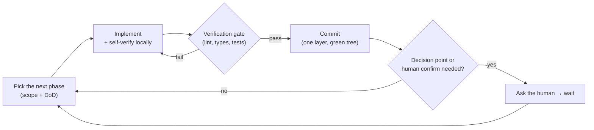
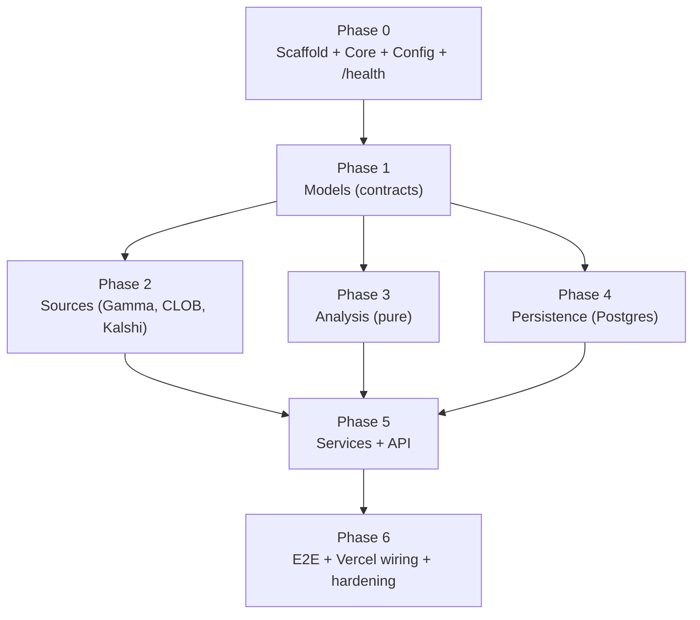

# PLANNING.md

The phase-by-phase build plan for this repository. It tells how to build, verify, and continue — contracts first, then capabilities, then composition, then end-to-end — with a verification gate at every step. No phase starts until the previous one passes its gate.

Read alongside `CLAUDE.md` (the standards) and `ARCHITECTURE.md` (the structure).

> **v1 scope.** These phases build v1: Polymarket + Kalshi → probabilities → Postgres → API, on Vercel. The **LLM** and **on-chain smart-money** layers are **v2** (see `ARCHITECTURE.md` §9); they are out of scope here and only appear as unwired seams.

---

## 1. Operating principle

> **Build a thin slice → verify it → integrate → only then continue.**

Work flows forward only through green gates: lint clean, types clean, the relevant tests pass. Defects are caught at the layer they are introduced, never inherited. Each phase is committed separately and leaves the tree green.

---

## 2. The build–verify–continue loop

A worker (you) implements one scope at a time to the standards in `CLAUDE.md`. On a doc mismatch, an API shape that differs from docs, or a genuine decision point, **stop and surface it** — never guess, never silently "fix" a binding fact.

---

## 3. Phase dependency graph

Phases 2, 3, and 4 depend only on contracts (Phase 1) and can proceed in any order. Phase 5 needs all three capability layers.

---

## 4. Phases in detail

Each phase gives: **objective**, **tasks**, **definition of done (DoD)**, and the **verification gate**.

### Phase 0 — Scaffold + Core + Config + `/health`
- **Tasks:** create the `app/` tree per `ARCHITECTURE.md` §4; finalise `pyproject.toml` (fastapi, uvicorn, httpx, asyncpg, pydantic, pydantic-settings; dev: pytest, pytest-asyncio, respx, ruff, mypy); `config.py` (pydantic-settings: DB URL, venue base URLs, topics/priority/maps, thresholds, TTLs, `CRON_SECRET`, log level/format); `core/logging.py` (JSON + correlation-id contextvar), `core/middleware.py`, `core/errors.py` (+ handlers), `core/http.py`, `core/rate_limit.py`; `main.py` wiring + lifespan that opens/closes the asyncpg pool; `GET /health` (process up + DB round-trip); commit `.env.example`, gitignore `.env`.
- **DoD:** app boots; `/health` reports DB reachability; logs are structured JSON with a correlation id; `.env.example` lists every var; no secrets committed.
- **Gate:** app starts; `/health` responds; `ruff` + `mypy` clean; a smoke test for `/health` passes; a startup log line shows JSON + correlation id.

### Phase 1 — Models (contracts)
- **Tasks:** implement `models/requests.py`, `domain.py`, `responses.py`, `provenance.py` per `ARCHITECTURE.md` §7. `Decimal` for money, `Literal`/`enum` for venues/sides, UTC datetimes. `TopicAnalysis` includes per-venue availability, disclaimer, and `llm_synthesis: None` (v2 seam).
- **DoD:** every boundary type exists and is importable; models validate good data and reject bad.
- **Gate:** `mypy` clean; a test instantiates each model with valid data and asserts a validation error on bad data.

### Phase 2 — Sources (I/O)
- **Tasks:** **verify each API shape against official docs first** (Gamma `/search`/`/events`/`/markets`/`/tags`; CLOB `/book`/`/midpoint`; Kalshi `/markets`/`/markets/{ticker}`/`orderbook`; per `CLAUDE.md` §13 and `DATA_SOURCES.md`). Implement `polymarket_gamma.py`, `polymarket_clob.py`, `kalshi.py` — typed in/out, async, no business logic, using the shared `core/http` client and per-source rate limiter + backoff.
- **DoD:** each client returns shared `models/` types; rate limiting/backoff active; every call logs venue, status, latency, retries; failures raise specific `SourceError` subtypes; schema drift raises `SchemaDriftError`.
- **Gate:** `respx`-mocked tests per client (happy path + 429-retry + drift-raises) pass; no live calls in the suite; types clean.

### Phase 3 — Analysis (pure) — *parallelisable with 2 & 4*
- **Tasks:** implement `probability.py`, `distribution.py`, `changes.py` as **pure functions** — no network, no `httpx`/`asyncpg` imports. Pin the **"thin" thresholds** (`THIN_SPREAD`, `THIN_VOLUME`) and `MATERIAL_CHANGE` from config.
- **DoD:** functions take plain `models/` data and return typed results; `normalise_distribution` returns raw + normalised + factor; the thin-market flag fires on the agreed threshold; `probability_change` flags materiality correctly.
- **Gate:** unit tests with **hand-checked** expected values (outcomes summing to 1.07 → assert factor; wide spread → assert flag; delta just over/under threshold) pass; no network import detectable.

### Phase 4 — Persistence (Postgres) — *parallelisable with 2 & 3*
- **Tasks:** write `persistence/schema.sql` (`market_observations`, `market_change_log` per `INGESTION.md`); `MarketRepository` ABC + `PostgresMarketRepository` (asyncpg: upsert observations with atomic change columns, append change-log, read current/tracked/history, purge stale); `migrate.py` to apply the schema explicitly.
- **DoD:** repository methods return/accept `models/` types; upsert never downgrades a `tracked`/`high` row; DDL only runs via `migrate`.
- **Gate:** types clean; repository unit-tested against a fake/in-memory implementation of the ABC, or an optional integration test gated behind a `TEST_DATABASE_URL` env var (skipped when absent). No DDL on hot paths.

### Phase 5 — Services + API
- **Tasks:** `discovery_service.py` (+ reconcile/pair across venues), `analysis_service.py` (read store → bounded live top-up when stale → assemble `TopicAnalysis`), `ingestion_service.py` (`discover → flag → analyse → upsert → log → purge`). `api/`: `POST /analyze`, `GET /markets/search`, `GET /markets/{venue}/{id}`, `GET /markets/history`, `GET /health`, `GET /internal/refresh` (`CRON_SECRET`-guarded). Thin handlers returning Pydantic models.
- **DoD:** `/analyze` returns a full `TopicAnalysis` with provenance + flags + per-venue availability + disclaimer; degradation branches log at `WARNING` and return partial results; `/internal/refresh` runs the ingester; OpenAPI renders at `/docs`.
- **Gate:** service tests with **all externals mocked** (repository + sources) pass, including each degradation branch (no Kalshi match; one market fails; live top-up fails → stale; DB down → 503); orchestration reads as named steps (SLAP); `/docs` loads.

### Phase 6 — End-to-end + Vercel wiring + hardening
- **Tasks:** one end-to-end `/analyze` test with everything mocked covering a degradation path; verify logs reconstruct a request by correlation id; finalise `vercel.json` (routes + 2h cron on `/internal/refresh`); document Neon provisioning; confirm no hardcoded secrets/addresses/URLs/model names; confirm `/docs`.
- **DoD:** the project-level Definition of Done (`CLAUDE.md` §15) holds.
- **Gate:** full suite green and deterministic; e2e passes; a grep finds no secrets/addresses/base URLs hardcoded in code (all from config).

---

## 5. Review lenses (apply to every phase before committing)

- **Architecture** — Dependency rule honoured (no inner layer importing an outer one; no cycles)? SRP per module? SLAP within functions? Files in the right place? `analysis/` free of network/SQL imports? Swap points behind ABCs?
- **Code quality** — Every boundary Pydantic-typed and validated? `Decimal` for money, `Literal`/`enum` for categoricals, UTC datetimes? Functions small and single-purpose? `get_logger(__name__)`, no `print`, no bare `except`?
- **Test/QA** — Suite green and deterministic? `analysis/` expected values hand-checked (not snapshotted)? Network mocked with `respx`, repository mocked in service tests? Degradation branches tested? No live endpoints in the suite?
- **Security/compliance** — Read-only everywhere (no signing/order placement/custody)? No secrets/addresses/URLs/model names hardcoded; `.env` gitignored, `.env.example` placeholders only? No secrets in logs? Polymarket on **Polygon** (not Ethereum); **no** wallet logic for Kalshi? Disclaimer and per-venue signal availability surfaced?

---

## 6. Decision points (ask, do not silently pick)

Surface these before the dependent phase proceeds:
- **Topic → Gamma mapping:** how a fuzzy topic resolves to `/search` terms vs `tag_id` filtering (and the per-topic limit). — gates Phase 2.
- **"Thin" market:** the spread width (`THIN_SPREAD`) and volume floor (`THIN_VOLUME`) that trip the low-confidence flag. — gates Phase 3.
- **Material change:** the delta (`MATERIAL_CHANGE`, default 1pp) that writes a change-log row. — gates Phase 3/4.
- **Live-top-up TTL:** the freshness window (`LIVE_TTL_SECONDS`) before `/analyze` re-fetches live. — gates Phase 5.

---

## 7. Project-level Definition of Done

See `CLAUDE.md` §15. In short: validated boundaries; hand-checked `analysis/` tests; repository behind its ABC and mocked in service tests; rate limiting/backoff/short-TTL caching; provenance + confidence flags + per-venue availability on every response; all degradation paths tested; correlation-id logs reconstruct any request; `/docs` renders; nothing hardcoded; read-only against every venue.
