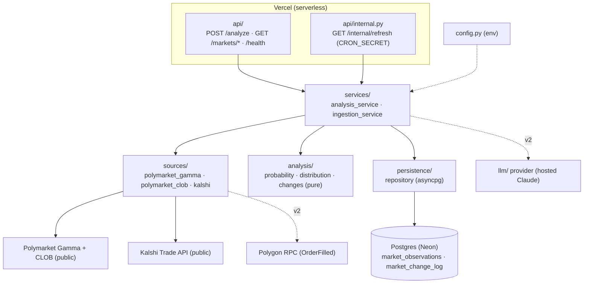

# Prediction-Market Analysis API

A **read-only** data backend that, given any free-text topic, discovers the live prediction
markets on it across **Polymarket** and **Kalshi**, converts their prices into
market-implied probabilities, stores the current state and how it changes over time in
**Postgres**, and serves it as typed JSON other codebases can query.

This is decision-support data infrastructure — **not** trade execution and **not** financial
advice. It only ever reads.

> **Scope note (v1).** This repository targets a lean first version: **Polymarket + Kalshi
> prices → probabilities → Postgres → API**, deployed on **Vercel**. The **LLM synthesis**
> layer and the **on-chain smart-money** (Polygon RPC) layer are designed-for but **deferred to
> v2** — they exist as clean seams in the architecture, not as wired code. See
> [§ Roadmap](#roadmap). The original docs described both at once; everything here is now
> reconciled to v1.

---

## What it gives you

- **Discovery** — the live markets matching a topic across both venues.
- **Probabilities** — each outcome's market-implied probability (a Polymarket YES token at
  $0.34 ≈ 34%; a Kalshi contract at 34¢ ≈ 34%), normalised across sibling outcomes to sum to 1.
- **Provenance** — every probability traces to a source, raw value, timestamp, and
  normalisation factor. "Why 62%?" is always answerable.
- **Evolution** — a cron re-checks every 2 hours, and for markets you flag high-priority it
  records how the probability moved, so you can see how the market's belief changed over time.
- **An API** — `POST /analyze`, `GET /markets/search`, `GET /markets/{venue}/{id}`,
  `GET /markets/history`, `GET /health`, `GET /docs`.

### Three facts the whole design depends on
- **Polymarket runs on Polygon (chain ID 137), not Ethereum mainnet.** (Relevant to the v2
  on-chain layer only.) There is no Polymarket trade ledger on Ethereum.
- **Kalshi is a centralised, CFTC-regulated exchange with no blockchain** — prices/volume/depth
  come from its REST API; there are no wallets, so smart-money analysis (v2) is
  **Polymarket-only**.
- **Reading prices needs no authentication or wallet on either venue.** Auth is only for
  trading, which this project never does.

---

## How it works — the hybrid read model

The headline endpoint is `POST /analyze {topic}`. It is served by a **hybrid** of a warm store
and live fetches, so callers get fresh answers fast:

1. A **Vercel cron** hits `GET /internal/refresh` every 2 hours (guarded by `CRON_SECRET`),
   running the **ingester**: discover the configured watchlist topics across both venues, read
   prices, compute probabilities, and **upsert** them into Postgres. Tracked topics also get a
   row appended to the change-log when they move materially.
2. `POST /analyze {topic}` serves from **Postgres** when the topic is on the watchlist (instant),
   and otherwise does a **bounded live top-up** fetch (Gamma + CLOB + Kalshi) within the
   function timeout, returning a typed `TopicAnalysis` either way.

Lean v1 ingestion is only HTTP calls (no on-chain backfill), so it fits comfortably inside a
Vercel function's timeout — **no separate GitHub Actions job is needed**. When the v2 on-chain
layer arrives (long RPC backfills), that heavy job moves to GitHub Actions writing the same
Postgres; the API contract does not change. See `DEPLOYMENT.md`.

---

## Architecture

Layered, dependencies pointing inward. The same `app/` package powers both the serving API and
the cron-driven ingester; they differ only in entry point.



**Dependency rule:** `api → services → {sources, analysis, persistence}`; `analysis` and
`models` import nothing outward. The database sits behind a `MarketRepository` abstract base, so
the persistence implementation is swappable and mockable. The `llm/` and `polymarket_chain.py`
seams are present in the architecture but unwired in v1.

Full detail in `ARCHITECTURE.md`.

---

## Data model

Two tables (DDL in `app/persistence/schema.sql`). You own the database; the app takes a
`DATABASE_URL` and reads/writes through the repository.

- **`market_observations`** — current state, one row per `(venue, market_key, outcome)`,
  upserted every run. Carries the change *as columns* (`previous_probability`,
  `probability_delta`), provenance (`raw_price`, `volume`, `liquidity`, `confidence`), and the
  flags (`priority`, `tracked`) plus `last_seen_at` (drives retention).
- **`market_change_log`** — append-only history: a row each time a tracked market moves
  materially. This is the time series of how belief evolved.

**Three behaviours:** everything discovered is upserted (static layer); topics in
`HIGH_PRIORITY_TOPICS` become `tracked` and get change-log rows when a move clears
`MATERIAL_CHANGE` (default 1pp); untracked rows older than `RETENTION_DAYS` (default 15) are
purged. Details in `INGESTION.md`.

---

## Quickstart

```bash
cp .env.example .env          # set DATABASE_URL + INGEST_TOPICS
pip install -e ".[dev]"

python -m app.ingest          # one ingestion run -> Postgres
uvicorn app.main:app --reload # serve the API at http://localhost:8000/docs
curl -X POST localhost:8000/analyze -H 'content-type: application/json' \
     -d '{"topic":"fed rate decision"}'
```

**Deploy (Vercel):** deploy with `vercel.json` (`@vercel/python`); provision **Neon Postgres**
via the Vercel Marketplace; set env vars in the project; the cron in `vercel.json` drives
`/internal/refresh`. See `DEPLOYMENT.md`.

---

## Configuration

All via environment / `.env` (see `.env.example`). Highlights:

| Variable | Purpose |
|---|---|
| `DATABASE_URL` | Postgres connection (use a **pooled** DSN on serverless) |
| `INGEST_TOPICS` | comma-separated free-text topics the cron tracks |
| `HIGH_PRIORITY_TOPICS` | subset flagged high-priority (tracked + retained) |
| `CATEGORY_MAP`, `KALSHI_SERIES_MAP` | optional JSON maps (topic→category; topic→Kalshi series) |
| `RETENTION_DAYS`, `MATERIAL_CHANGE`, `THIN_VOLUME`, `THIN_SPREAD`, `PER_TOPIC_LIMIT` | behaviour knobs |
| `GAMMA_BASE_URL`, `CLOB_BASE_URL`, `KALSHI_BASE_URL` | venue endpoints (verify per `DATA_SOURCES.md`) |
| `LIVE_TTL_SECONDS` | freshness window before `/analyze` does a live top-up |
| `CRON_SECRET`, `LOG_LEVEL`, `LOG_FORMAT` | cron auth + logging |
| `POLYGON_RPC_URL`, `CTF_EXCHANGE_ADDRESS` | **v2** on-chain enrichment (blank = disabled) |

---

## Roadmap

| Version | Scope |
|---|---|
| **v1 (this build)** | Polymarket + Kalshi → probabilities + provenance → Postgres → `/analyze` & read API, on Vercel. Rate-limited sources, graceful degradation, full test suite. |
| **v2 — LLM synthesis** | A hosted `LLMProvider` (Claude) behind the existing abstraction: typed synthesis of a distribution (caveats, divergences, what would move it). Emits **no** numbers/IDs/advice. |
| **v2 — on-chain smart-money** | `polymarket_chain.py` reads `OrderFilled` on Polygon; wallet scoring + smart-money tilt. Heavy backfill runs on GitHub Actions into the same Postgres. |

---

## Companion documents

| File | What it covers |
|---|---|
| `README.md` | this overview |
| `CLAUDE.md` | coding standards / guardrails (read every session in Claude Code) |
| `ARCHITECTURE.md` | full repository architecture and dependency rules |
| `PLANNING.md` | phase-by-phase build plan with verification gates |
| `DATA_SOURCES.md` | verified reference for how Polymarket/Kalshi work and how to query them |
| `DEPLOYMENT.md` | Vercel hosting + Neon Postgres + cron model |
| `INGESTION.md` | the data model, priority/TTL/change-tracking, and run instructions |
